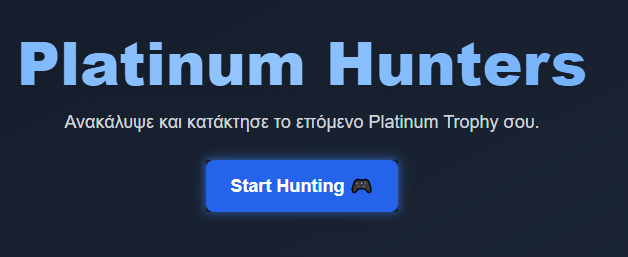

<div id="top"></div>

[![Issues][issues-shield]][issues-url]
[![MIT License][license-shield]][license-url]
[![LinkedIn][linkedin-shield]][linkedin-url]

<!-- PROJECT LOGO -->
<br />
<div align="center">
    

  <h3 align="center">Platinum Hunters GR</h3>

  <p align="center">
    This is a Reactjs app for tracking the Covid 19 cases recoveries and deaths worldwide and per country.
    <br />
    <br />
    <a href="https://platinum-hunters-gr.vercel.app/" target="_blank">View MVP</a>
    ·
    <a href="https://platinum-hunters-gr.vercel.app/pages/contact">Report Bug</a>
    ·
    <a href="https://github.com/Michalis89/Platinum-Hunters-GR/issues">Request Feature</a>
  </p>
</div>

<!-- TABLE OF CONTENTS -->
<details>
  <summary>Table of Contents</summary>
  <ol>
    <li>
      <a href="#about-the-project">About The Project</a>
      <ul>
        <li><a href="#built-with">Built With</a></li>
      </ul>
    </li>
    <li>
      <a href="#getting-started">Getting Started</a>
      <ul>
        <li><a href="#prerequisites">Prerequisites</a></li>
        <li><a href="#installation">Installation</a></li>
        <li><a href="#deployment">Deployment</a></li>
      </ul>
    </li>
    <li><a href="#api-usage">API</a></li>
    <li><a href="#license">License</a></li>
  </ol>
</details>

<!-- ABOUT THE PROJECT -->

## About The Project

[![Product Name Screen Shot][product-screenshot]](https://platinum-hunters-gr.vercel.app/)

Platinum Hunters GR is a platform to help users find trophies guides for various games. Users can:

- Search for trophies guides.
- Browse and create guides to achieve trophies (TBD).
- Track their progress in different games.

<p align="right">(<a href="#top">back to top</a>)</p>

### Built With

Below are the technologies used to bootstrap and deploy the project:

- [Next.js](https://nextjs.org/)
- [Supabase](https://supabase.io/)
- [Tailwind CSS](https://tailwindcss.com/)
- [Rawg API](https://rawg.io/apidocs)
- [Vercel](https://vercel.com/)

<!-- GETTING STARTED -->

## Getting Started

Set up your project locally.
To get a local copy up and running follow these simple steps.

### Prerequisites

For starters if don't have NodeJs at your local machine you have to install <a href="https://nodejs.org/en/download/">from here</a>

- npm

  ```sh
  npm install npm@latest -g

  ```

### Installation

1. Clone the repo

   ```sh
   git clone https://github.com/Michalis89/Platinum-Hunters-GR.git

   ```

2. Install NPM packages

   ```sh
   npm install

   ```

3. Set up the environment:
   Create the `.env.local` file and add the following variables:

   ```sh
   SUPABASE_URL=your_supabase_url
   SUPABASE_ANON_KEY=your_supabase_anon_key
   RAWG_API_KEY=your_api_key

   ```

4. Run the development server

   ```sh
   npm run dev

   ```

### Deployment

To deploy the app on Vercel:

1. Build the app

   ```sh
   npm run build

   ```

## Deploy using Vercel's CLI or GUI

1. **Install Vercel CLI**

   ```sh
   npm install -g vercel

   ```

2. **Login to Vercel**

   ```sh
   vercel login

   ```

3. **Deploy the project**

   ```sh
   vercel

   ```

  <p align="right">(<a href="#top">back to top</a>)</p>

<!-- LICENSE -->

## License

Distributed under the MIT License. See `LICENSE.txt` for more information.

<p align="right">(<a href="#top">back to top</a>)</p>

<!-- MARKDOWN LINKS & IMAGES -->

[issues-shield]: https://img.shields.io/github/issues/Michalis89/platinum-hunters-gr.svg?style=for-the-badge
[issues-url]: https://github.com/Michalis89/platinum-hunters-gr/issues
[license-shield]: https://img.shields.io/github/license/Michalis89/platinum-hunters-gr.svg?style=for-the-badge
[license-url]: https://github.com/Michalis89/platinum-hunters-gr/blob/develop/LICENSE.txt
[linkedin-shield]: https://img.shields.io/badge/-LinkedIn-black.svg?style=for-the-badge&logo=linkedin&colorB=555
[linkedin-url]: https://www.linkedin.com/in/michalis-mouzakitis-b80891126/
[product-screenshot]: assets/screenshot.png
