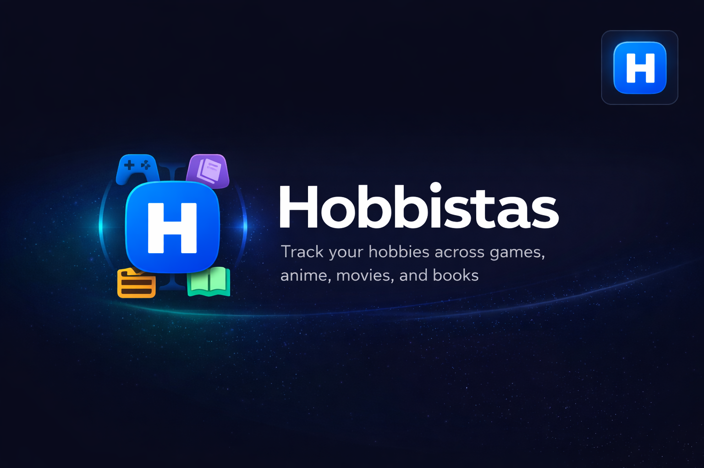

<div align="center">
  

  <h1>Hobbistas</h1>

  <p>
    <strong>A Greek hobby tracking platform for trophy guides, backlog management, and multi-media libraries</strong>
  </p>

  <p>
    <a href="https://platinumhunters.gr">Live Demo</a> &bull;
    <a href="#features">Features</a> &bull;
    <a href="#getting-started">Getting Started</a> &bull;
    <a href="#deployment">Deployment</a> &bull;
    <a href="docs/ARCHITECTURE.md">Architecture</a>
  </p>

  <p>
    
    
    
    
    
  </p>
</div>

---

## Overview

Platinum Hunters (Hobbistas) is a comprehensive platform for Greek gaming enthusiasts to discover trophy guides, track their gaming backlog, and manage their entertainment libraries across multiple hobbies including gaming, anime, movies, and books.

### Key Features

- **Trophy Guides** - Detailed platinum trophy walkthroughs with difficulty ratings, time estimates, and step-by-step instructions
- **Backlog Management** - Track games across statuses (playing, completed, dropped) with personal ratings and hours logged
- **Multi-Hobby Support** - Unified library for games, anime, movies, books, and TV shows
- **User Profiles** - Customizable profiles with PSN integration, statistics, and favorites
- **Activity Feed** - Real-time community activity and personal progress tracking
- **Rich Text Editor** - Create and edit guides with a full-featured Tiptap editor
- **Article System** - News, reviews, and community content with categories and topics

---

## Tech Stack

| Layer          | Technology                           |
| -------------- | ------------------------------------ |
| **Framework**  | Next.js 15 (App Router)              |
| **UI**         | React 19, Tailwind CSS 3.4           |
| **State**      | Redux Toolkit + RTK Query            |
| **Database**   | Supabase (PostgreSQL)                |
| **Auth**       | Supabase Auth (JWT)                  |
| **Rich Text**  | Tiptap 3.17                          |
| **Animation**  | Framer Motion                        |
| **Testing**    | Jest, React Testing Library, Cypress |
| **Deployment** | Vercel                               |

### External APIs

- **RAWG** - Game metadata and search
- **PlayStation Network** - Trophy data via psn-api
- **TMDB** - Movie and TV information
- **MyAnimeList** - Anime database
- **Google Books** - Book search and metadata

---

## Getting Started

### Prerequisites

- Node.js 18+
- npm or yarn
- Supabase account (free tier works)

### Installation

```bash
# Clone the repository
git clone https://github.com/Michalis89/Platinum-Hunters-GR.git
cd Platinum-Hunters-GR

# Install dependencies
npm install
```

### Environment Setup

Create a `.env.local` file in the root directory:

```bash
# Required - Supabase
NEXT_PUBLIC_SUPABASE_URL=https://your-project.supabase.co
NEXT_PUBLIC_SUPABASE_ANON_KEY=your-anon-key
SUPABASE_SERVICE_ROLE_KEY=your-service-role-key

# Required - Site
NEXT_PUBLIC_SITE_URL=http://localhost:3000

# Optional - External APIs
RAWG_API_KEY=your-rawg-key
TMDB_ACCESS_TOKEN=your-tmdb-token
MAL_CLIENT_ID=your-mal-client-id
MAL_CLIENT_SECRET=your-mal-secret
GOOGLE_BOOKS_API_KEY=your-google-books-key
```

### Development

```bash
# Start development server
npm run dev

# Run linting
npm run lint

# Run tests with coverage
npm test

# Run E2E tests
npm run cypress:open
```

Open [http://localhost:3000](http://localhost:3000) to view the application.

---

## Scripts

| Script                 | Description                            |
| ---------------------- | -------------------------------------- |
| `npm run dev`          | Start development server               |
| `npm run build`        | Production build                       |
| `npm run start`        | Start production server                |
| `npm run lint`         | Run ESLint                             |
| `npm test`             | Run Jest tests with coverage           |
| `npm run ci`           | Full CI pipeline (lint + test + build) |
| `npm run sitemap`      | Generate sitemap                       |
| `npm run cypress:open` | Open Cypress E2E tests                 |

---

## Deployment

### Vercel (Recommended)

The application is optimized for Vercel deployment.

#### Quick Deploy

[](https://vercel.com/new/clone?repository-url=https://github.com/Michalis89/Platinum-Hunters-GR)

#### Manual Deploy

```bash
# Install Vercel CLI
npm install -g vercel

# Login and deploy
vercel login
vercel
```

#### Environment Variables on Vercel

Add the following environment variables in your Vercel project settings:

| Variable                        | Required | Notes                                   |
| ------------------------------- | -------- | --------------------------------------- |
| `NEXT_PUBLIC_SUPABASE_URL`      | Yes      | Your Supabase project URL               |
| `NEXT_PUBLIC_SUPABASE_ANON_KEY` | Yes      | Supabase anonymous key                  |
| `SUPABASE_SERVICE_ROLE_KEY`     | Yes      | Supabase service role key (server-only) |
| `NEXT_PUBLIC_SITE_URL`          | Yes      | Your production domain                  |
| `RAWG_API_KEY`                  | No       | For game metadata                       |

### Vercel Configuration

The project includes a `vercel.json` for deployment configuration:

```json
{
  "ignoreCommand": "if [[ \"$VERCEL_GIT_COMMIT_REF\" != \"deploy-vercel\" ]]; then exit 0; else exit 1; fi"
}
```

> **Note:** Currently configured to only deploy from the `deploy-vercel` branch.

---

## Architecture

For detailed architecture documentation, see [docs/ARCHITECTURE.md](docs/ARCHITECTURE.md).

### Project Structure

```
src/
├── app/                    # Next.js App Router
│   ├── (main)/            # Main layout group
│   ├── (legal)/           # Legal pages group
│   ├── api/               # API route handlers (43 endpoints)
│   └── components/        # React components (122 files)
├── store/                 # Redux store configuration
│   ├── slices/           # Redux slices
│   └── api/              # RTK Query APIs
├── lib/                   # Core libraries
│   ├── supabase/         # Database client & types
│   └── services/         # Business logic
├── types/                 # TypeScript definitions
├── utils/                 # Utility functions
└── config/               # App configuration
```

### Key Architectural Decisions

1. **App Router** - Full Next.js 15 App Router with route groups
2. **Client-Heavy** - Most pages use client components for interactivity
3. **Redux** - Global state management for auth, backlog, and filters
4. **Cookie-Based Auth** - httpOnly cookies synced from Supabase
5. **Multi-Client Supabase** - Separate clients for browser, server, and route handlers

---

## CI/CD Pipeline

### Branch Protection

- All feature branches follow: `feat/PH-*`, `fix/PH-*`, `hotfix/PH-*`
- Merging requires: passing status checks + code review

### Status Checks

- **Linting** - ESLint with Next.js config
- **Testing** - Jest unit tests with coverage
- **Build** - Production build verification

---

## Troubleshooting

### Common Vercel Issues

#### Build Fails with Memory Error

```bash
# Increase Node memory limit in package.json scripts or Vercel settings
NODE_OPTIONS=--max-old-space-size=4096 npm run build
```

#### Playwright/Chromium Errors

The scraper feature uses Playwright which is **not compatible with Vercel Serverless Functions**. The scraper is disabled by default and controlled via the `SCRAPER_ENABLED` environment variable.

```bash
# To enable scraper in development only:
SCRAPER_ENABLED=true

# In production, leave unset or set to false - returns 503 Service Unavailable
```

For production scraping, consider external services like Browserless.io or Apify.

#### Cold Start Timeouts

If API routes timeout on first request:

1. Check function duration in Vercel dashboard
2. Consider adding `maxDuration` configuration in `vercel.json`
3. Optimize heavy imports with dynamic loading

#### Supabase Connection Issues

For serverless environments:

1. Use Supabase connection pooler URL
2. Avoid singleton patterns in route handlers
3. Handle connection errors gracefully

### Local Development Issues

#### Port Already in Use

```bash
npx kill-port 3000
npm run dev
```

#### Supabase Auth Not Working

1. Verify `.env.local` variables are set correctly
2. Check Supabase dashboard for auth configuration
3. Ensure redirect URLs are configured in Supabase Auth settings

---

## Contributing

1. Fork the repository
2. Create a feature branch: `git checkout -b feat/PH-XX-description`
3. Make your changes
4. Run tests: `npm test`
5. Submit a pull request

### Code Style

- TypeScript strict mode
- ESLint + Prettier
- Tailwind CSS utility classes
- Component-based architecture

---

## Documentation

- [Architecture Overview](docs/ARCHITECTURE.md) - System design and data flow
- [Production Review](docs/REVIEW.md) - Audit findings and recommendations
- [Future Features](docs/FUTURE_FEATURES.md) - Roadmap and planned enhancements

---

## License

Distributed under the MIT License. See [LICENSE.txt](LICENSE.txt) for more information.

---

<div align="center">
  <p>
    <a href="https://github.com/Michalis89/Platinum-Hunters-GR/issues">Report Bug</a> &bull;
    <a href="https://github.com/Michalis89/Platinum-Hunters-GR/issues">Request Feature</a>
  </p>
  <p>Made with care for the Greek gaming community</p>
</div>

[product-screenshot]: assets/screenshot.png
