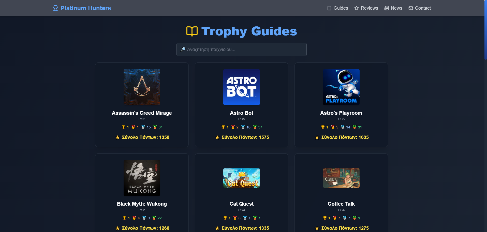

# Platinum Hunters GR

Platinum Hunters GR είναι μια εφαρμογή που βοηθά τους χρήστες να βρουν πληροφορίες για **trophies** και **achievements** από διάφορα παιχνίδια, με σκοπό την εύκολη παρακολούθηση των στόχων και την αναζήτηση οδηγών για την επίτευξή τους.

## Table of Contents

- [Περιγραφή](#περιγραφή)
- [Τεχνολογίες](#τεχνολογίες)
- [Χρήση](#χρήση)
- [Εγκατάσταση και Ρύθμιση](#εγκατάσταση-και-ρύθμιση)
- [Contributing](#contributing)
- [Άδεια Χρήσης](#άδεια-χρήσης)
- [MVP Deployment](#mvp-deployment)

## Περιγραφή

Αυτή η εφαρμογή επιτρέπει στους χρήστες να:

- Αναζητούν trophies και achievements για συγκεκριμένα παιχνίδια.
- Δημιουργούν και κοινοποιούν οδηγούς για την ολοκλήρωση αυτών των στόχων.
- Ενημερώνουν τις πληροφορίες παιχνιδιών και οδηγών.
- Συμμετέχουν σε μια κοινότητα που μοιράζεται τα επιτεύγματά τους.

## Τεχνολογίες

Η εφαρμογή έχει αναπτυχθεί με τις παρακάτω τεχνολογίες:

- **Next.js** - Για το frontend και την δημιουργία server-side rendering.
- **Supabase** - Για την διαχείριση της βάσης δεδομένων και την αυθεντικοποίηση χρηστών.
- **Tailwind CSS** - Για το responsive και μοντέρνο UI.
- **PostgreSQL** - Η βάση δεδομένων για την αποθήκευση δεδομένων χρηστών και παιχνιδιών.
- **Vercel** - Για τη φιλοξενία της εφαρμογής.

## Χρήση

1. **Σύνδεση και Εγγραφή**:
   Οι χρήστες μπορούν να δημιουργήσουν λογαριασμό και να συνδεθούν με τον Supabase authentication.

2. **Περιήγηση και Αναζήτηση**:
   Οι χρήστες μπορούν να περιηγηθούν σε οδηγούς για συγκεκριμένα παιχνίδια και να αναζητήσουν trophies.

3. **Δημιουργία Οδηγών**:
   Οι χρήστες με τα κατάλληλα δικαιώματα μπορούν να δημιουργήσουν και να δημοσιεύσουν οδηγούς για τη συλλογή trophies.

## Εγκατάσταση και Ρύθμιση

Ακολουθήστε τα βήματα παρακάτω για να ρυθμίσετε το project τοπικά:

### 1. Κλωνοποιήστε το repository:

```bash
git clone https://github.com/Michalis89/platinum-hunters-gr.git
cd platinum-hunters-gr
```

### 2. Εγκαταστήστε τις εξαρτήσεις:

```bash
npm install
```

### 3. Ρυθμίστε το περιβάλλον:

Δημιουργήστε το αρχείο .env.local και προσθέστε τις παρακάτω μεταβλητές:

```bash
SUPABASE_URL=your_supabase_url
SUPABASE_ANON_KEY=your_supabase_anon_key
```

### 4. Ξεκινήστε την εφαρμογή:

```bash
npm run dev
```

### 5. Ανοίξτε την εφαρμογή στον browser:

Πηγαίνετε στο [http://localhost:3000](http://localhost:3000) για να δείτε την εφαρμογή.

## Άδεια Χρήσης

Αυτό το project χρησιμοποιεί την άδεια **MIT License**.

## MVP Deployment

Το MVP της εφαρμογής είναι ήδη αναπτυγμένο και φιλοξενείται στο Vercel. Μπορείς να το δεις στον εξής σύνδεσμο:

[platinum-hunters-gr.vercel.app](https://platinum-hunters-gr.vercel.app)

### Screenshot της εφαρμογής


